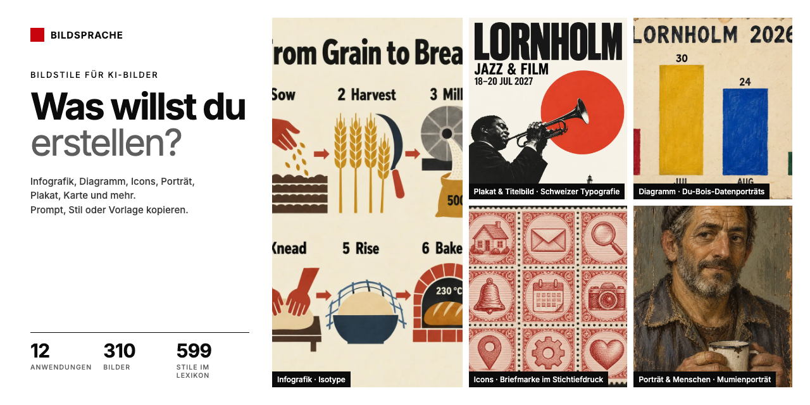

[Read in English → README.md](README.md)

# Bildsprache

**Ein Motiv, viele Bildsprachen: KI-Bilder müssen nicht gleich aussehen.**

Bildstile nach Anwendung (Infografik, Diagramm, Icons, Porträt, Produkt, Plakat, Illustration, Karte, Stimmungsbild):
310 Bilder in 115 Leitstilen, jedes mit dem Prompt, der es erzeugt hat, dem Stilblock allein und einer
Vorlage für eigene Inhalte. Dazu ein Lexikon mit 599 ausgewählten Bildstilen und eine Übersicht, woran man KI-Bilder erkennt.

**[Katalog öffnen](https://grundhofer.github.io/bildsprache/)** ·
[Deutsch](https://grundhofer.github.io/bildsprache/de/) ·
[English](https://grundhofer.github.io/bildsprache/en/)



## Worum es geht

KI-Bilder sehen oft gleich aus: warmes Gegenlicht, glatte Haut, Motiv in der Bildmitte, Infografiken aus
denselben bunten Kacheln. Das liegt meistens am Prompt. Wer Medium, Technik, Epoche, Komposition und Schrift
genau beschreibt, bekommt sehr unterschiedliche Bilder.

Bildsprache zeigt das an 19 Grafiktypen, die alle auf der erfundenen Insel Lornholm spielen:
Szene mit Menschen, Porträt, Infografik, Landschaft, Produkt, Plakat, Editorial, Straße, Essen, Tier, Figur,
Karte, Icon-Set, Datendiagramm, Innenraum, Botanik, Video-Thumbnail, Titelfolie und Social-Media-Post. Jedes Motiv läuft durch viele Stile, von altägyptischer
Wandmalerei über Cyanotypie und Polnische Plakatschule bis Pixel-Art.

## Wie ein Prompt gebaut ist

```
Style: <Stilblock – Medium, Komposition, Schrift, Informationsaufbau, Vermeidungen>

Subject: <Motivblock – bei allen Bildern eines Motivs wortgleich>

Constraints: <Leitplanken – Format, erlaubter Text, nichts schönen, keine Logos>
```

Der Motivblock legt den Inhalt fest, nicht die Anordnung. Der Stilblock ist für alle Bilder eines Stils wortgleich.
Die Basislinie ist derselbe Prompt ohne Stilblock und zeigt den Standardlook des Modells. Der Build prüft für jedes
veröffentlichte Bild, dass sein Prompt genau so zusammengesetzt ist.

## Inhalt

- **[Anwendungen](https://grundhofer.github.io/bildsprache/de/):** der Einstieg. Jede Anwendung fasst eines oder mehrere der 19 Motive zusammen, zeigt sie in allen Stilen mit Kopierknöpfen (ganzer Prompt, nur Stil) und hat eine Vorlage zum Ausfüllen mit eigenen Inhalten.
- **[Leitstile](https://grundhofer.github.io/bildsprache/de/stile/):** 115 Faktenblätter mit Herkunft, Merkmalen, Stilblock zum Kopieren und Quellen.
- **[Lexikon](https://grundhofer.github.io/bildsprache/de/lexikon/):** 599 ausgewählte Stile in 14 Kategorien (Leitstile und alle Einträge mit großem Abstand zum KI-Look und hoher Machbarkeit), jeweils mit Prompt-Baustein, manche mit kleinem Beispielbild. `data/lexicon.json` enthält alle recherchierten Einträge.
- **[KI-Look & Hebel](https://grundhofer.github.io/bildsprache/de/hebel/):** typische Merkmale von KI-Bildern, jeweils mit Gegenhebel, und Stilhebel zu Licht, Optik, Komposition, Farbe und Schrift.
- **[Methode](https://grundhofer.github.io/bildsprache/de/methode/):** wie Bilder und Texte entstanden, wie geprüft wurde und wo die Grenzen liegen.

## Lokal bauen

Benötigt Python 3.12+. Keine Paketinstallation nötig.

```sh
python3 build.py
python3 -m http.server 8000 --directory docs
python3 -m unittest discover -s tests -v
```

## Bilder erzeugen

Die Bilder entstehen mit dem eingebauten Bildwerkzeug von [Codex CLI](https://github.com/openai/codex) und brauchen
ein angemeldetes Codex. `cwebp` wandelt sie für die Website um.

```sh
python3 tools/plan.py jobs.json          # Zellen ohne Bild mit aktuellem Prompt
python3 tools/generate.py jobs.json      # erzeugt originals/<motiv>/<stil>-<n>.png
python3 tools/manifest.py                # wählt pro Zelle die geprüfte Fassung (data/qa.json)
python3 tools/optimize.py                # WebP-Dateien in images/
```

Die Beispielbilder des Lexikons laufen über dasselbe Werkzeug:

```sh
python3 tools/lexicon.py plan jobs.json  # Lexikonstile ohne Beispielbild (--pilot, --category, --reroll)
python3 tools/generate.py jobs.json      # erzeugt originals/lexicon/<stil>-<n>.png
python3 tools/lexicon.py manifest        # wählt pro Stil die geprüfte Fassung (data/lexicon_qa.json)
python3 tools/lexicon.py optimize        # WebP-Dateien in images/lexicon/
```

## Projektaufbau

| Pfad | Inhalt |
| --- | --- |
| `data/usecases.json` | Die Anwendungen: zugehörige Motive, Vorlage mit Platzhaltern |
| `data/motifs.json` | Die Motive mit Motivblock, Format und erlaubtem Text |
| `data/matrix.json` | Welcher Stil auf welchem Motiv erscheint |
| `data/lexicon.json` | Alle Stile mit Kategorie, Merkmalen und Prompt-Baustein |
| `data/qa.json` | Prüfergebnis jeder Bildfassung, auch der verworfenen |
| `data/lexicon_motifs.json`, `data/lexicon_qa.json` | Motive und Prüfergebnisse der Lexikon-Beispielbilder |
| `styles/*.json` | Zweisprachige Faktenblätter der Leitstile mit Stilblock |
| `images/` | Veröffentlichte Bilder (WebP) und `manifest.json` mit Prompt und Metadaten je Bild |
| `tools/` | Prompt-Baukasten, Generator, Planer, Prüfungen |
| `web/`, `build.py` | Seitenstil, Seitenskript, Texte und statischer Generator |
| `docs/` | Erzeugte Website; nicht eingecheckt |

GitHub Actions prüft die Daten und veröffentlicht `main` auf GitHub Pages. Wie man einen Stil ergänzt, steht in
[CONTRIBUTING.md](CONTRIBUTING.md).

## Kennzeichnung und Lizenz

Alle Bilder sind KI-generiert (OpenAI-Bildgenerierung über Codex CLI) und als solche gekennzeichnet.
Code: [MIT](LICENSE). Texte: [CC BY 4.0](LICENSE-CONTENT.md). Bilder: [CC0](LICENSE-CONTENT.md).
Stilnamen beschreiben Techniken, Epochen und Bewegungen; lebende Künstlerinnen und Künstler, Studios und Marken
werden nicht als Stil genannt.

Schwesterprojekt: [Designsprache](https://github.com/grundhofer/designsprache), ein Katalog von UI-Designsprachen.

© Sebastian Grundhöfer
